# Eclipse插件开发笔记	开发基础

## 1	Eclipse IDE环境篇

### 1.1.1    安装及使用eclipse IDE

运行eclipse IDE前需要先安装Java运行环境（JRE）[jdkx6417.zip](https://pan.baidu.com/s/1zA4bai3tLlDNLPcTRzBwsA) 提取码: yxf6。在eclipse网站`http://www.eclipse.org/downloads/` 下载eclipse IDE[eclipse-jee-indigo-SR2-win32-x86_64.zip](https://pan.baidu.com/s/1pbRoywR2yS1H9OvVMt00OQ) 提取码:uf7h。

主界面样式

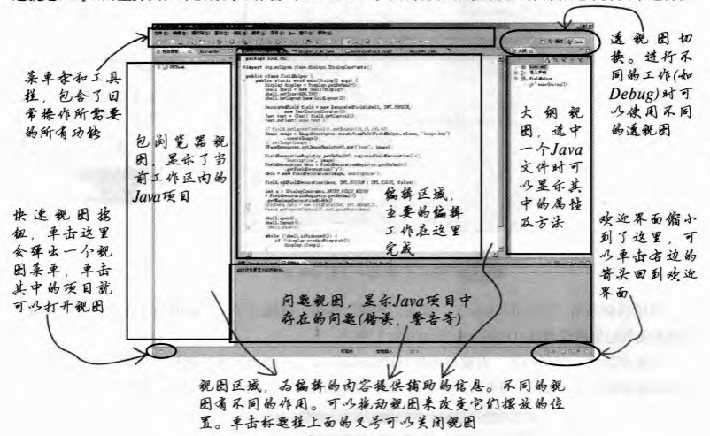

### 1.1.2    eclipse IDE安装中文语言包

下载[语言包]( https://pan.baidu.com/s/1yjoSwztCHKcQZzdFrDRFBA) 提取码: 6a9g  ，在eclipse安装目录下创建`myplugins`目录。解压文件修改文件名为language。

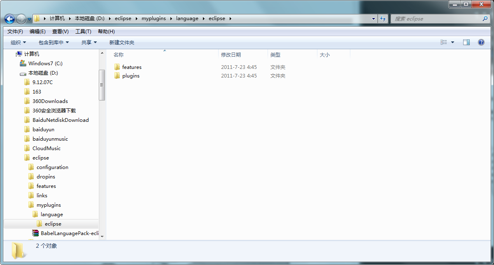

在eclipse安装目录下创建`links`目录，在`links`目录下创建`language.link`文件，在文件中写入插件目录`path=D://eclipse//myplugins//language`，重启eclipse。

> 恢复回英文环境只需要删除`links`目录下的`language.link`文件

### 1.2	eclipse 名词解释

- J2EE项目的（Web Tools Platform）
- 开发报表的BIRT（Business Intelligence and Reporting Tools）
- 富客户端平台（Rich Client Platform ，RCP）
- 嵌入式系统和设备项目开发。包括开发C/C++程序的CDT（C++ Development Toolkit）移动设备和J2ME项目的MTJ以及嵌入式设备的富客户端开发平台ERCP
- 富Internet应用程序（Rich Internet Application）。指利用ajax结合JavaScript开发具有丰富用户体验的Internet应用程序。 

### 1.3    SWT/JFace

#### 1.3.1	SWT

==SWT==（Standard Widget Toolkit，标准图形工具箱） 是一种Java开发的GUI程序的技术。与出自Sun的AWT（Abstract Widget Toolkit，抽象图形工具箱）和Swing不同，SWT是Eclipse的开发人员自行建造的。

==AWT==是Java最早的GUI技术，它采用了交集的办法来解决不同操作系统的图形平台不同显示风格的问题。

==Swing==是Sun提出的另外一种GUI解决方案，除了图形平台自己的一套标准的控件外，一般都会支持用户手绘界面的功能。但是完全脱离操作系统的支持，不能使用操作系统的消息处理机制而必须自己管理这些消息，影响了性能。

==SWT==技术吸取了AWT/Swing的优点。它同时采用了两者的一部分思想，吸取各个图形平台的经验决定自己的一个控件集合，然后针对某个目标平台进行判断，目标平台上有的控件直接使用，没有的控件采用Swing的方法进行绘制。

==JFace==是一套基于SWT的工具箱。它将一些常用的界面操作包装了起来，对界面设计进行了更高层次的抽象，使开发人员可以抽出更多精力关注程序的业务逻辑。JFface的设计目的是和SWT协同工作。

### 1.4	插件技术和OSGI

Eclipse平台包含有很多功能模块，如JDT（Java Development Toolkit）等模块的历史几乎和Eclipse一样悠久，以至于人们认为它们是Eclipse平台不可或缺的组成部分，事实上Eclipse平台不包含任何专用的模块，它的设计遵循微内核理念，即提供最基本的运行时环境，简单的系统和模块之间交互的渠道，而各模块则使用这些服务运行并相互交流。

为了处理模块之间的依赖关系，Eclipse提出了扩展（Extension）和扩展点（Extension Point）的概念。每一个希望被别的程序模块扩展的模块，都必须声明一系列的扩展点。而希望在这个模块上扩展功能的程序模块，就需要按照扩展点声明来编写扩展。扩展点提供服务功能，而扩展使用这些服务。凡遵循这套扩展规则的模块，都可以方便的往体系中添加或删除，即==可插拔==的，因而被称为==插件==（Plug-in）。

插件技术使得系统的结构简练，可维护性与可扩展性大增。但是一切都是插件，使得插件的数量同样大增。因为用户不可能同时使用所有的插件，Eclipse采用了延迟加载（Lazy Loading）的技术，只有一个插件被其他插件调用的时候才将它装载到内存中。

延迟加载体系中，扩展和扩展点的声明，都通过遵循特定规范的XML文件完成的。这些文件被称为==清单==（Manifest），在这些清单中指明了具体实现扩展功能的Java代码。

```xml
<!--扩展点声明 -->
<extension-point id="views"							
                 name="org.eclipse.ui.views //扩展点名称"		 	
                 schema="schema/views.exsd //Eclipse专用的manifest格式描述文件。对扩展点的xml格式进行定义"/>         
<!--扩展声明 -->
<extension point="org.eclipse.ui.views //扩展点名称">
	<view allowMultiple="false" class="org.harper.ecocenter.client.ManageView //扩展功能具体实现类" id="org.harper.ecocenter.client.ManageView" name="Manage"
</extension>
```

==OSGi==（Open Services Gateway initiative ，开放式服务网关协议）是一套基于Java的开放式接口协议。它的思想与Eclipse插件的思想有些类似，然而OSGi的框架体系实现了在运行时对模块动态添加和删除功能的支持。

### 1.5	RCP技术

Eclipse RCP是帮助开发者创建和部署富客户端的平台。所谓服客户端，是指为用户提供了丰富功能体验的客户端程序。通常来说，一个富客户端程序应该有以下特征。

- 首先是桌面程序而不能是WEB应用程序；
- 可以暂时性的脱离网络运行，还可以对客服端的本地资源，如文件系统、打印机等进行操作。其次，界面美观，功能丰富，具有跨平台性并且可以和操作系统的图形平台紧密结合（支持拖拽操作，可以在系统托盘中显示），对用户的操作响应性好（在网络不畅时不能停止响应）
- 富客户端可以承担一定程度的数据缓存以及业务逻辑计算功能，如出现新版本时自动升级系统等。  

### 1.6	EMF技术

在编写面向对象的程序中，首先必须将实际生活中的例子抽象成Java对象来建立结构化的数据模型。==EMF==（Eclipse Modeling Framework，Eclipse建模框架）就是一项致力于简化建模工作的项目。用户只需要描述需要建立的模型，就可以通过EMF生成健壮的、易于使用的数据模型实现代码。EMF项目由一下三大部分组成。

- EMF核心框架

  EMF框架允许用户通过编写Java接口，从Rose导入UML类图等方法生成一个描述用户需要的数据模型的元模型（Meta Model）。在EMF项目中，这个元模型被称为Ecore。它描述着数据模型中包含哪些对象，对象中有哪些方法和属性，以及这些对象间关系。用户可以直接从这个元模型生成数据模型的实现代码，这些代码是基于EMF运行时框架的。

- EMF.Edit

  它提供的功能都和数据模型编辑相关。它为数据模型提供各种功能的适配器，使得生成的数据模型可以直接作为JFace的内容来源，也可以在Eclipse的属性师徒中展示出来病可编辑。这部分框架需要和CodeGen配合使用

- EMF.CodeGen

  这部分用于代码生成。生成的数据模型代码除包含了数据模型的接口和实现外，还包含了一个工厂类用于生成数据模型的实例，以及一个Package类型，其中包含了数据模型的元数据。同时，CodeGen也可以生成一个基于Eclipse RCP的编辑器，用于对数据模型的内容进行编辑。

EMF主要适用与模型驱动（Model Driven）的程序

### 1.7	GEF技术

图形化编辑可以直观的显示模型对象的属性和对象之间的关系，在很多情况下都很有用，如UML类图设计，工作流程图设计等。==GEF==（Graphical Editing Framework）是为了方便开发者开发基于RCP的，支持图形化编辑的程序界面设计的一套框架。


## 2	SWT/JFace概述

SWT技术是第一套基于Java的第三方图形工具库。它的设计思想是提供一套通用的API使得开发出的图形程序不仅可以不加修改的在平台间移植，而且外观和速度上与使用C/C++等语言在操作系统平台上开发出来的本地图形程序毫无区别，还可以只用鼠标拖放操作、系统托盘等高级的系统服务。

SWT程序与操作系统交互时，使用了JNI技术。简单来说是讲Java语言编写的接口与C语言编写的函数绑定，从而使得调用Java接口就等于调用C函数的技术。

### 2.1	SWT结构浅析

SWT的基本体系结构分为三层如图


- 第一层是SWT的API。外部开发者使用SWT时就是使用这些API编写SWT程序。这里包含了SWT的控件（文本框，按钮等）、时间处理（各种时间及监视器）、等和图形界面开发者关系最为密切的部分。同时也只有这一部分对外部开发者可见。
- 第二层时JNI相关的代码。每个操作系统提供的API都拥有自己定义的一系列独特的数据类型作为参数类型及返回值。这一层只在SWT内部可见。
- 第三层是使用C程序编写的操作系统本地动态链接库文件。这一层的代码在window平台上编译成DLL文件，而在linux上编译为so文件。

### 2.2	SWT API结构

SWT API的基本构成

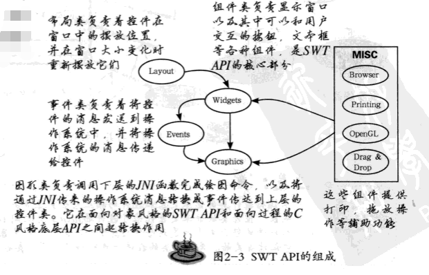

#### 2.2.1	组件类	Widgets

组件是用户界面的组成部分。在一个SWT程序中，界面上的所有内容，如按钮、文本框等，包括窗口本身都是组件。整个图形界面是有组件构成的。

组件分为控件（Control）和项目（Item）。控件是界面的主体，项目依赖于控件并未他们提供附加功能。有些控件是专门用来容纳、分组其他控件的，它们被称为容器控件。窗口控件（Shell）就属于容器控件。

#### 2.2.2	布局类	Layout

它主要是由布局管理器（Layout Manager）组成。当一个布局管理器被安装到窗口上之后，它就负责着在窗口中安排控件位置和尺寸。当窗口尺寸变化时，布局管理器会根据一定的策略重新计算这些数据，并将控件安排在合适窗口新尺寸的位置上。不同的布局管理器，就代表了安防控件的一种不同策略。

#### 2.2.3	事件类	Events

事件类主要负责控件的消息传递。用户点击了界面上一个按钮，在文本框中输入了一段文字，或者仅仅是移动了一下鼠标，都会产生一个事件（Event）。事件是图形界面程序与用户交互的核心。SWT的事件处理机制采用了事件监听器（Event Listener）的结构，即使用Observer（观察者）的设计模式来处理时间。对某个对象上的某个事件感兴趣的话，就需要在对象上注册一个对应的事件的监听器。当事件发生时，所有在对象上注册过的此事件监听器都会收到通知。

监听器是一个接口，其中包含的每个方法都对应了某种事件的发生，而其参数包含了所有发生的事件的上下文。以鼠标事件MouseEvent为例，它对应的监听器是MouseListener，其中包括三个方法，如下面代码所示。从名字可以看出，三个方法分别对应了鼠标双击、鼠标按下和鼠标放开的事件，而其参数MouseEvent类，则包含了鼠标单击位置，哪一个按钮被按下等信息。

```java
public void mouseDoubleClick(MouseEvent e);
public void mouseDown(MouseEvent e);
public void mouseUp(MouseEvent e);
```

如果希望为窗口中某一个按钮加上双击的处理函数，就要实现一个MouseListener接口，并在mouseDoubleClick方法中加上处理代码，然后调用Button类的addMouseListener方法，将这个监听器添加到按钮的监听器队列中。这样当鼠标双击按钮时，mouseDoubleClick方法就会被调用。这里的按钮被称为事件源（Event Sourse）。

使用监听器的优点在于事件源不必关心具体的监听者究竟是谁。这种结构使得模块之间耦合度较低，易于维护和修改。SWT中预定义了许多事件，其中包含的一些事件列表：

|       监听器       | 事件名         | 描述                                             |
| :----------------: | -------------- | ------------------------------------------------ |
|   MouseListener    | MouseEvent     | 监听鼠标按钮按下事件                             |
| MouseMoveListener  | MouseEvent     | 监听鼠标移动事件                                 |
| MouseTrackListener | MouseEvent     | 监听鼠标进入、离开事件源的事件                   |
|    KeyListener     | KeyEvent       | 监听按键事件                                     |
|  ControlListener   | ControlEvent   | 监听控件尺寸或位置改变的事件                     |
|  DisposeListener   | DisposeEvent   | 监听控件被销毁的事件                             |
|   FocusListener    | FocusEvent     | 监听控件得到焦点的事件                           |
| SelectionListener  | SelectionEvent | 监听控件被选中（按钮被单击、复选框被勾选）的事件 |

#### 2.2.4	图形类与系统资源管理

图形类隐藏在SWT API的最下层，一般的开发人员很少会直接使用到它的内容，但了解这部分知识是深入理解和学习SWT的基础。图形类主要由两部分构成，即Resource和Display。

在编写图形界面程序时，所有空间、图片、字体等图形对象都会耗费系统资源。因为系统上可用的资源总是有限的，为保证这些资源被最大限度的利用，程序必须负责及时释放这些资源。资源在SWT中由Resource类的子类，如Font，Image等所使用，而分配或释放它们的操作则由Display负责和操作系统交互而完成。Display将不同的操作系统中对事件循环的实现分装成SWT的统一事件循环机制，它还提供了丰富的方法用来访问操作系统的资源，因此可以将其视为SWT与底层操作系统交流的桥梁。

在SWT中创建Display实例的线程被称为界面线程（UI Thread）。界面线程具有以下特性或者说限制。

- Display的事件循环必须在它的界面线程中执行
- 所有通过Display完成的绘图操作都只能在它的界面线程中执行
- 同一个界面线程中，不能同时创建俩个有效的Display实例

为了理解这些限制，有必要理解GUI图形界面程序运行的基本原理。GUI程序运行的机制就是针对用户在界面上的每一个操作事件作出反应，即所谓“事件驱动”。操作系统为每一个GUI程序分配了一个事件队列，用于存放属于他的事件。每当用户操作鼠标或键盘时，操作系统会根据鼠标点击的位置，当前的焦点窗口等信息决定把事件放到哪个队列中。而在GUI程序中，需要用一个循环不停的去读取自己的事件列表，每当有新的事件时，就处理这个事件并作出适当的绘图动作反馈到用户。这就是事件循环（Event Loop）。这个循环不停的将消息传递到GUI程序的各个部分，好像一个水泵一样，因此也称为“消息泵”。事件循环机制是GUI程序的心脏，GUI事件处理基本原理如图

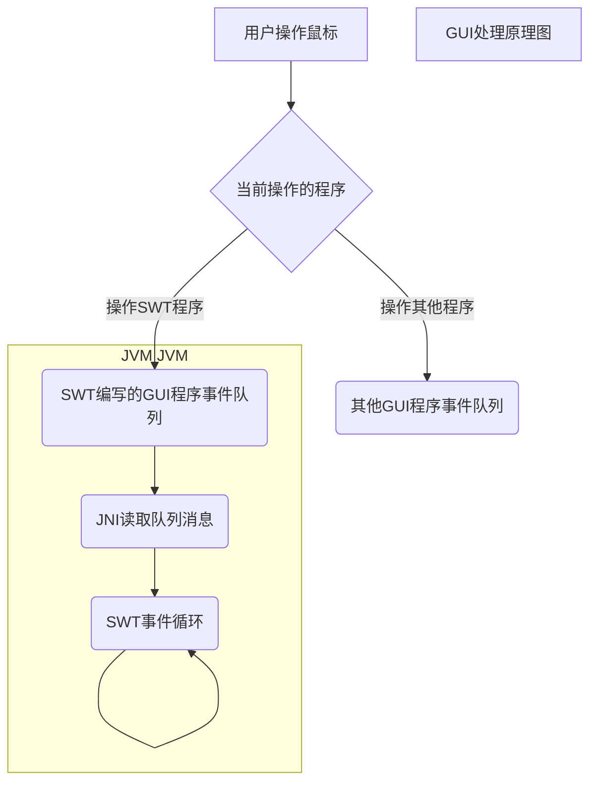

在目前的主流操作系统中，对事件循环的处理存在两种模型，一种是单线程模型，这种模型只允许程序中的一个线程监听事件消息并作出绘图动作，另外一种是允许程序中所有线程自由访问程序事件队列的多线程模型。为了保持平台兼容性，降低实现的复杂度，SWT使用单线程模型管理事件循环和绘图操作。这也是存在上面三条限制的主要原因。

采用单线程模型的好处主要是，首先，使用单线程模型不仅可以更好的管理内存，减少操作系统的线程数，也能促使程序将绘图操作集中到一起，首先业务逻辑与绘图代码的分离，结构更清晰，调试起来更容易；其次，在许多主流操作系统中，图形操作并不是简单地依次执行，专门的图形引擎会对这些操作进行优化以提高效率。将绘图操作集中在同一个线程中提交，有利于优化引擎最大程度的发挥作用。

在SWT中，没有系统资源的自动分配与释放机制，资源的管理是由程序员手动完成的。对于资源的使用与释放有如下两条原则。

- **谁分配谁释放**（If you created it,you dispose it）
- **释放父资源时，所有子资源都会被一起释放**（Disposing the parent dispose the children）

### 2.3	JFace

JFace是基于SWT的一套图形工具包，它没有为SWT提供任何新的功能，只是将一些比较繁琐而且常用的图形操作封装了起来，是的开发工作变得简便。JFace完全使用SWT API进行开发，并没有涉及任何SWT中平台相关的部分，所以JFace没有不同平台版之分。JFace封装涉及的范围：

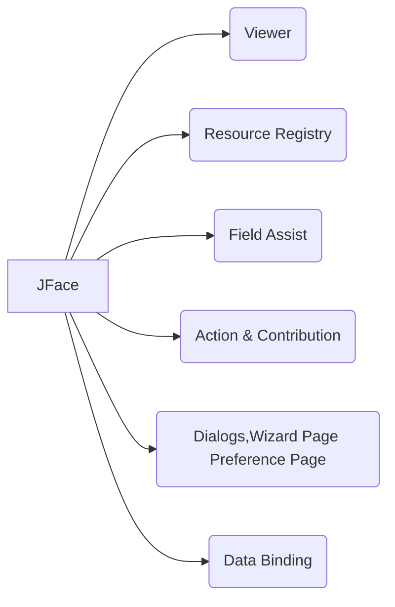

- Viewer 查看器
- Resource Registry 资源注册表，用于管理和自动释放程序中用到的图形系统资源
- Field Assist 字段帮助。使用它在控件附近默认显示提示性标记和内容
- Action & Contribution 操作与贡献。这是用于控制菜单、工具栏等一套框架
- Dialogs,Wizard Page Preference Page 对话框，向导页与首选项设置
- Data Binding 数据绑定。将数据模型与图形界面上的控件绑定起来减少了程序为了同步它们的数据而做的重复工作

#### 2.3.1    查看器

查看器（Viewer）是使用MVC模式对一些复杂控件做的封装，以方便开发人员使用这些控件。目前的查看器包括列表查看器 （ListViewer）、表格查看器（TableViewer）、树查看器（TreeViewer）等。

查看器将数据模型从复杂控件中抽象出来，本身作为一个控制器来监听模型的变化和控件的变化，并负责传递这些变化。开发者不需要具体操作那些复杂控件，查看器收到通知后也会发送数据模板，数据模型收到通知后可以检查这些修改并决定是否接受。查看器并没有将控件隐藏起来，开发者可以随时通过查看器提供的方法（如TableViewer的getTable方法）得到对应的底层控件对象并直接操作它。

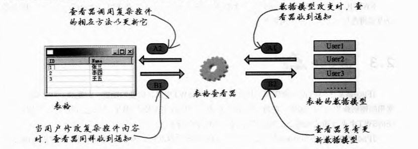

#### 2.3.2	资源注册表

使用SWT图形资源的一个原则就是“谁申请谁释放”，然而，正如许多C++程序员经常忘记释放数组空间而导致的内存泄露一样，当程序结构复杂的时候，要求严格执行这一点不是一件容易的事。资源注册表就是为了方便管理常用的图形资源而设计的，目前JFace包含了针对字体、颜色和图像资源的注册表

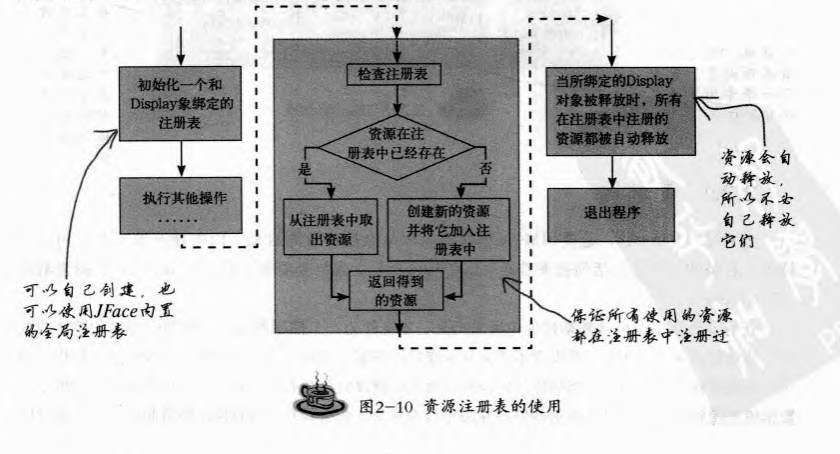

JFace在JFaceResources类中为这些注册表提供了采用Singleton模式的实现。使用这些资源注册表，就可以有效地避免因为忘记释放资源而导致的系统资源泄露问题。

#### 2.3.3	字段帮助

字段帮助（Field Assit）的目的是为最终用户提供界面指导。在设计用户界面时，程序员通常需要为用户提供一些指导信息，比如哪些字段是必填的，字段可以接受的数值类型及取值范围等的说明。

字段帮助提供两种功能，一种是字段装饰（Decoration Field），另一种是内容建议（Content Proposal）。字段装饰可以让开发者在控件的四角添加图片或者颜色作为装饰，以提示用户字段的当前状态。内容建议则允许开发者在控件附近弹出一个下拉框，并在其中提供 一些内容选项供用户选择。这个提示框可以由焦点触发，也可以设置成由某个热键触发。


#### 2.3.4	操作和贡献

操作和贡献（Action & Contribution）是用来定制菜单和工具栏的一套机制。这套机制将菜单项/工具栏按钮和它们所触发的事件分离开来，使得对用户操作响应的控制更灵活。

Action对象封装了一个操作命令。当Action对象被添加到工具栏或菜单上面时，用户单击对应的工具栏按钮和菜单项就可以触发这个Action对象所代表的命令。为了可以显示在工具栏或菜单上，Action对象还包含有图标、工具提示（tooltip）等用于显示的信息。

贡献由贡献项目（Contribution Item）和贡献管理器（Contribution Manager）两部分组成。操作可以用来在菜单或工具栏上添加项目，而利用操作中包含的图标等信息来显示工具栏按钮或菜单项的工作是有贡献项目完成的。贡献管理器是包含了火哥贡献项目的集合。贡献项目代表了菜单或工具栏中的一项，贡献管理器则代表了整个菜单或工具栏。JFace的贡献管理器可以用来控制菜单、工具栏和状态栏。

#### 2.3.5	对话框、向导页和偏好设置

在SWT的对话框控件的基础上，JFace实现了许多定制的对话框。如带图标的对话框、可以在系统托盘中显示的对话框、供用户输入的对话框等。

向导页用来引导用户一步步的完成某个操作的界面；而偏好设置可用用来设计专业的用户选项卡。JFace的框架帮助开发者完成了页面切换的工作，使开发者只需要编写每一页的内容并将它们添加到框架中就可以实现向导页或偏好设置的功能。

#### 2.3.6	数据绑定

数据绑定是把查看器的概念扩展到了整个界面。将真个图形界面（一个窗口、一个对话框等）看成一个复杂控件，并将它关联到一个数据模型上。数据绑定功能负责监听界面上所有控件和数据模型的内容，无论哪一方发生变化时都即时通知另一方。

### 2.4	Swing

Swing采用了使模型和显示分离的方法。控件本省并不包含任何与绘画相关的代码，而是将绘图代码分离到另一个类“UI类”。UI类的结构和SWing控件的类型结构基本上是一一对应的。比如和JBtton（Swing的中控件）类型相对的UI类是ButtonUI。Swing将这些UI类声明为抽象类，并要求每种LookAndFeel都实现自己的UI类型，在其中添加具体负责绘制控件的图形代码。

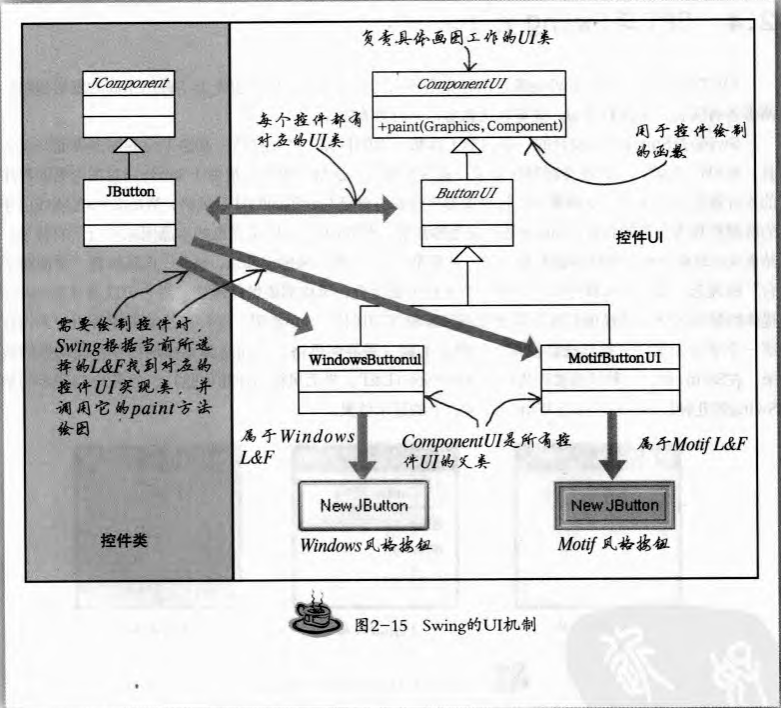

### 2.5	编写并发布SWT程序

​	**首先安装WindowBuilder插件**[WB_v1.5.1_UpdateSite_for_Eclipse3.7.zip](https://pan.baidu.com/s/1u-1SVUMaR0cTRrYytf4kvg) 提取码: 2em4

#### 2.5.1	第一个SWT程序

在Eclipse中创建一个新的项目。

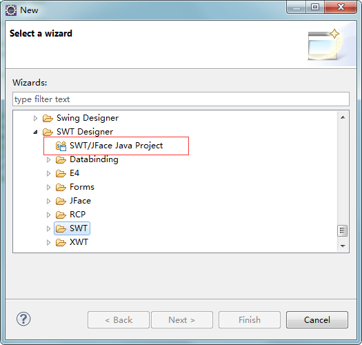

创建java文件

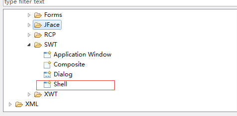

第一个SWT程序代码

```java
public class HelloShell extends Shell{
    private static Text text;
    private static Button swtButton;
    private static Button swingButton;
    private static Button awtButton;
    private static Group group;
    private static Button button;
    private static Label benefitOfSwtLabel;
    private static List list;
    public static void main(String[] args){
        //界面线程对象
        Display display = Display.getDefault();
        final Shell shell = new Shell(display);
        shell.setText("hello shell");
        shell.setSize(260,283);
        shell.open();
        text = new Text(shell,SWT.BORDER);
        text.setText("SWT是Eclipse平台使用的图形工具箱");
        //设置控件在窗口中的位置在上顶点为（10，8）宽度为230，高度为35
        text.setBounds(10,8,230,35);
        //List控件可以在界面上展示一系列的内容。
        list = new List(shell,SWT.BORDER);
        list.setItems(new String[]{"使用操作系统本地的控件","提供一套平台无关的API","GUI程序的运行速度快","更多更多....."});
        list.setBounds(10,68,232,82);
        benefitOfSwtLabel = new Label(shell,SWT.NONE);
        benefitOfSwtLabel.setText("SWT的优点");
        benefitOfSwtLabel.setBounds(10,49,90,15);
        //Group对象可以用来把相关的控件包装成一个组，在这组控件外面会显示一个边框，将它们与其他控件隔离开。
        group = new Group(shell,SWT.NONE);
        group.setText("你使用过哪些图形工具");
        group.setBounds(10,20,54,18);
        swingButton = new Button(group,SWT.CHECK);
        swingButton.addSelectionListener(new SelectionAdaptor(){
            public void widgetSelected(final SelectionEvent e){
                MessageBox msgBox = new MessageBox(shell,SWT.ICON_INFORMATION);
                msgBox.setMessage("hello swt");
                msgBox.open();
            }
        });
        swingButton.setText("来点击一下");
        swingButton.setBounds(70,22,60,15);
        shell.layout();
        while(!shell.isDisposed()){
            if(!display.readAndDispatch())	display.sleep();
        }
    }
}
```

#### 2.5.2	SWT程序的打包发布

本节将前面的项目打包发布，使其能够脱离Eclipse单独运行。首先，需要将完成的SWT项目从Eclipse中导出成JAR文件。然后使用`java -jar 文件`运行程序。

## 3	SWT编程基础

### 3.1	Display和Shell

编写图形界面程序的第一步是要为界面创建一个窗口。下面的代码创建了一个空白的窗口

```java
public static void main(String[] args){
	Display display = Display.getDefault();
	Shell shell = new Shell(display);
	shell.setSize(100,100);
	shell.open();
	shell.layout();
	while(!shell.isDisposed()){
		if(!display.readAndDispatch())	display.sleep();
	}
}
```

这个程序分为三大部分，1：创建Display对象；2：创建并配置Shell；3：进入一个循环。

#### 3.1.1	Display的创建

在实例程序的开始，首先得到一个Display对象。这是所有SWT程序开始运行时都必须执行的工作。没有Display，SWT程序就无法和操作系统交互，一个SWT程序至少需要一个Display对象。创建Display对象的线程被称为UI线程。

Display类提供了getDefault()方法。首次调用这个方法会创建一个Display实例，随后再次调用这个方法可以获取已创建的实例。在实例程序中由于main线程调用了Display.getDefault()方法，它就是所得到的Display对象的UI线程。

涉及到多个线程时，不应该使用Display.getDefault来得到当前线程所属的Display实例。这个方法在多UI线程的情况下很容易出现错误，下面代码就演示了一种常见的错误用法

```java
public static void main(String[] args){
  Display display = Display.getDefault();
  new Thread(){
    public void run(){
      //disp与display是同一个对象
      Display disp = Display.getDefault();
      //这里会产生一个非法线程访问的异常
      disp.dipose();
    }
  }
}
```

在开发多UI线程的程序时，推荐使用如下代码管理Display实例

```java
public static Display getThreadDisplay(){
  return Display.getCurrent()==null?new Display():Display.getCurrent();
}
```

#### 3.1.2	Shell的创建

在SWT中，一个Shell实例就代表了一个窗口。在创建了Shell后，Shell.setSize方法设置了窗口在屏幕上的尺寸（以像素为单位）；Shell.open()方法会将窗口显示在屏幕上；而后面Shell.layout()方法则与窗口布局管理有关。

Shell的构造函数

|             函数申明             | 功能                         |
| :------------------------------: | ---------------------------- |
| Shell(Display display,int style) | 通过display实例构造一个Shell |
|  Shell(Shell parent,int style)   | 通过shell实例构造一个Shell   |

Display、Shell和Shell窗口中的组件之间的父子依赖关系如下图。当Shell被释放时子资源的Shell和组件也会被释放，当Display被释放时子资源Display、Shell和组件都会被释放。

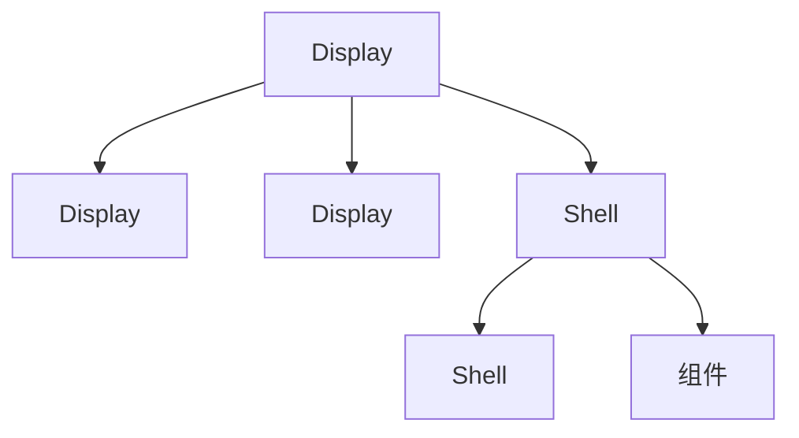

Shell.open()方法打开一个窗口后，它就会显示出来。使一个窗口显示的方法有两个，一个是调用Shell.close()，这个方法会关闭窗口，并释放掉其占用的系统图形资源；另一种则是Shell.setVisible(false)，这种方法只是暂时隐藏窗口，不会释放所占资源，调用Shell.setVisible(true),就可以让窗口再次显示出来。

#### 3.1.3	Display的时间队列和事件循环

创建一个窗口并打开它以后，示例就进入事件循环（Event Loop）部分，代码如下所示。

```java
while(!shell.isDisposed()){
	if(!display.readAndDispatch())	display.sleep();
}
```

在分析时间循环的代码之前，首先需要对Display的事件处理机制有个整体的认识。常见的图形界面操作系统会为每一个GUI程序分配一个事件队列，用户操作鼠标或键盘时，操作系统负责将这些事件放到对应的程序事件队列中。

但是除了系统事件之外，程序可能还希望在时间循环中处理一些自定义的事件。为此，Display额外维护了一个应用程序级别的时间队列，自定义的事件可以被添加到这个队列中。在Display的事件循环中，同时处理着系统队列和自定义队列中的事件。

下面代码是readAndDispatch()方法的内容，这个调用了很多org.eclipse.swt.internal.win32.OS类上面的方法。OS是SWT用来包装操作系统API的类型，它的函数都是JNI的接口，而且与操作系统API一一对应。

```java
public boolean readAndDispatch(){
	checkDevice();
	drawMenuBars();
	runPopups();
	if(OS.PeekMessage(msg,0,0,0,OS.PM_REMOVE)){
		if(!filterMessage(msg)){
			OS.TranslateMessage(msg);
			OS.DispatchMessage(msg);
		}
		runDeferredEvents();
		return true;
	}
	return runMessages && runAsyncMessages(false);
}
```

首先从事件队列中将事件读取出来（PeekMessage），经过必要的翻译后（TranslateMessage）发送到窗口处理(DispatchMessage)。

在调用操作系统API转发消息之前，SWT还使用filterMessage方法对消息事件做了过滤。在通常情况下，发送到窗口中控件的事件都会交由窗口的消息处理函数统一处理。如果事件是发送到某一个特定控件（如按钮、菜单等）的，这个方法允许控件“吃掉”这个事件而不发送到主窗口。如果在菜单和它的窗口中为同一个快捷键设置了不同的功能，打开菜单时，快捷键消息就会被菜单捕捉下来而不发送到窗口。

SWT的事件循环中，方法runDeferredEvents()和runAsyncMessages()负责处理Display的自定义事件。

Display.readAndDispatch()的流程，首先是从系统事件队列中读取消息，如果在程序的事件队列中读到事件，就将它发送到窗口去处理；如果在线程交互的事件队列中有需要执行的事件，就去执行它。

如果readAndDispatch返回false，事件循环就会调用Display的sleep()方法。sleep()方法内容如下

```java
public boolean sleep(){
	checkDevice();
    if(runMessages && getMessageCount()!=0)	return true;
    if(OS.IsWince){
        OS.MsgWaitForMultipleObjectsEx(0,0,OS.INFINITE,OS.QS_ALLINPUT,OS.MWMO_INPUTAVAILABLE);
        return true;
    }	
    //是的当前线程UI线程休眠，这样可以将处理器让给别的线程使用。当事件队列中有新的事件传来时，UI线程会被唤醒并恢复事件循环过程
    return OS.WaitMessage();
}
```

#### 3.1.4	Display的生命周期

一个SWT程序真正开始图形相关的操作，是从它创建一个Display实例开始的，而当程序不在需要这个Disney实例的时候，它就会被释放调。调用Disney的dispose方法，可以释放它所占用的资源。当一个Disney实例被释放时，所有它管理的Shell都会被同时释放。这也遵循着“释放父资源时子资源同时被释放”的法则。下面的代码演示了这一法则。

```java
public static void main(String[] args){
    Display display = Display.getDefault();
    Shell shell = new Shell(display);
    shell.setSize(200,100);
    Button button = new Button(shell,SWT.NONE);
    button.setText("dispose Display");
    button.setBounds(10,10,120,20);
    button.addSelectionListener(new SelectionAdapter(){
        public void widgetSelected(SelectionEvent e){
            Display.getDefault().dispose();
        }
    });
    shell.open();
    Shell shell2 = new Shell(display);
    shell2.setSize(200,100);
    shell2.open();
    while(!(shell.isDisposed() && shell2.isDisposed())){
        if(!display.readAndDispatch())	display.sleep();
    }
    //使用完毕后释放Display对象
    display.dispose();
}
```

以上代码，使用关闭按钮（释放）任意一个窗口都不会影响另外一个。而单击“dispose Display”的按钮两个窗口都会被释放。

#### 3.1.5	监视器、边界和客户区域
使用Display.getMonitors()方法可以取得与这个Display相连的所有监视器信息，而Display.getPrimaryMonitor()则可以得到主监视器对象。监视器对象主要包含边界和客户区域两个部分。边界代表了这个监视器的屏幕大小，而客户区域则代表了显示窗口在屏幕部分大小。一般来说，由于图形操作系统桌面任务栏占掉了一部分空间，客户区域要小于边界的尺寸。

```java
public static void main(String[] args){
  Display display = new Display();
  Monitor monitor = display.getPrimaryMonitor();
  //监视器的大小代表了整个桌面的大小
  System.out.println(monitor.getClientArea());
  //客户区域
  System.out.println(monitor.getBounds());
}
```

####  3.1.6	SWT程序中的多线程

SWT采用了单线程模型管理绘图操作，只有UI线程才能进行空间重绘和处理事件循环等直接访问Display的操作，非UI线程试图直接操作Display则会导致一个SWT异常。

简单地数据计算任务可以直接放到UI线程中执行，但在其中执行比较耗时的操作，却不是一个好的选择。下面的代码做了一个演示。

```java
public static void main(String[] args) throws Exception{
  final Display display = display.getDefault();
  Shell shell = new Shell(display);
  shell.setText("Multi Thread");
  shell.setSize(204,92);
  final Button button = new Button(shell,SWT.NONE);
  button.addSelectionListener(new SelectionAdapter(){
    public void widgetSelected(final SelectionEvent e){
      try{
        Thread.sleep(10000);
      }catch(InterruptedException e){
        e.printStackTrace();
      }
    }
  });
  button.setText("点击休眠10秒");
  button.setBounds(20,15,155,25);
  shell.open();
  shell.layout();
  while(!shell.isDisposed()){
    if(!display.readAndDispatch())play.sleep();
  }
}
```

执行这段程序，单击按钮之后，程序界面停止响应，直到10秒后才回复正常。如果程序执行一些稍微耗时的计算就会停止响应，这显然是用户无法接受的，这就出现了SWT的单线程模型与复杂的程序逻辑的矛盾。为了解决这个矛盾，必须为非UI线程（后台线程）提供一个途径，使它能将需要执行的操作通知UI线程。这个通知动作被称为后台线程与UI线程的同步。如图所示

```sequence
UI线程->后台线程:创建
后台线程-->>UI线程:同步
后台线程-->>UI线程:同步
```

Display维护了衣蛾自定义的事件队列，这个队列就是用来供后台线程和UI线程同步的。后台线程用Runnable对象将绘图操作包装起来，然后将对象插入到事件队列中，这样Display执行消息循环时就会执行这些操作了。Display提供了如下两个方法向这个队列中插入事件。

| Display.syncExec(Runnable runnable)  | 同步调用，调用这个方法会通知UI线程在下一次事件循环时执行runnable参数的run方法，调用这个方法的线程将被阻塞到runnable执行完成。如果参数为null，调用这个函数会唤醒休眠中的UI线程 |
| ------------------------------------ | ------------------------------------------------------------ |
| Display.asyncExec(Runnable runnable) | 异步调用，调用这个方法同样通知UI线程在下一次事件循环时执行runnable参数的run方法，调用这个方法的线程不会被阻塞，而且在runnable执行完后不会得到通知。如果参数是null，调用这个函数会唤醒休眠中UI线程 |

具体调用

```java
button.addSelectionListener(new SelectionAdapter(){
  public void widgetSelected(final SelectionEvent e){
    Thread thread = new Thread(){
      public void run(){
        try{
          Thread.sleep(10000);
        }catch(Exception e){
          e.printStackTrace();
        }
        display.syncExec(new Runnable(){
          public void run(){
            button.setText("Exection Done");
          }
        });
      }
    };
    thread.start();
  }
});
```

### 3.2	控件

#### 3.2.1	控件类的继承结构

所有控件都是从org.eclipse.swt.widget.Control继承而来，如图所示为一些主要控件的继承结构。

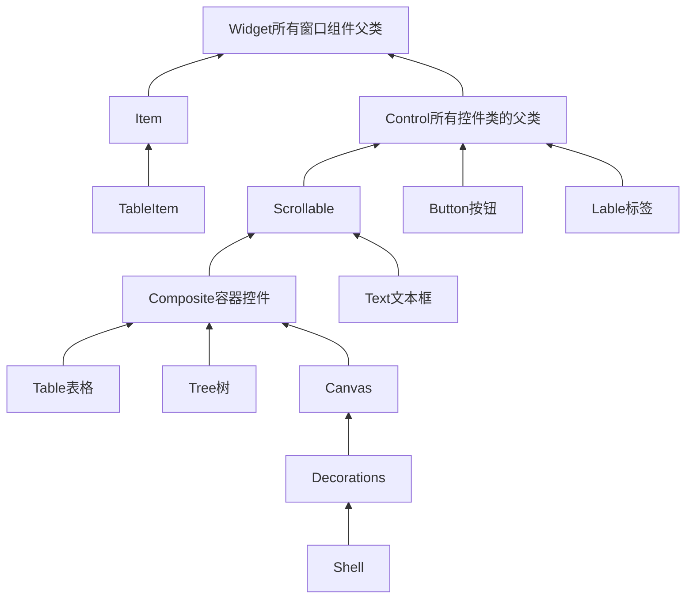

其中最上层的Widget类直接继承自Object，是SWT中所有和窗口相关部件的父类，它为所有窗口组件提供了创建对象（申请资源）、释放资源和事件监听的功能。

Widget有两个比较重要的子类，Control类是所有控件的父类；而Item类则是控件的辅助部分，它代表了复杂控件中的某一项，比如表格控件中的一样就是由TableItem来表示的。

Button、Label等简单控件都是直接继承自Control控件，Scrollable代表有滚动条的控件，它的子类有Text和Composite等；Composite被称为容器控件，这类控件的主要用途不是与用户交互，而是将容纳于其中的其他控件在界面上分组拜访，它的子类有Table、Tree等可以用来显示复杂数据结构的控件。

Canvas是允许程序员使用画点、线等基本图形操作在其中直接绘图的控件。Shell间接继承自Canvas类。

#### 3.2.2	控件的构造和样式

可以用Control(Control parent,int style)来构造一个控件实例，其中第一个参数指明了控件的父类资源，第二个参数是控件使用的样式。下面的代码在shell代表的窗口中使用BORDER和PUSH样式创建了一个Button控件。

```java
Button button = new Button(shell,SWT.BORDER|SWT.PUSH);
```

样式控制着控件很多方面的显示和行为方式，它们可以按照用途被归类为不同的组，同属一组的样式应用时只能选择一个。对控件而言，可以在控件类的JavaDoc中找到可用样式的具体说明。

如果没有没有特殊说明，子类可以使用父类的样式的。不同组的样式可以用“|”组合起来使用。

#### 3.2.3	控件的继承检查

