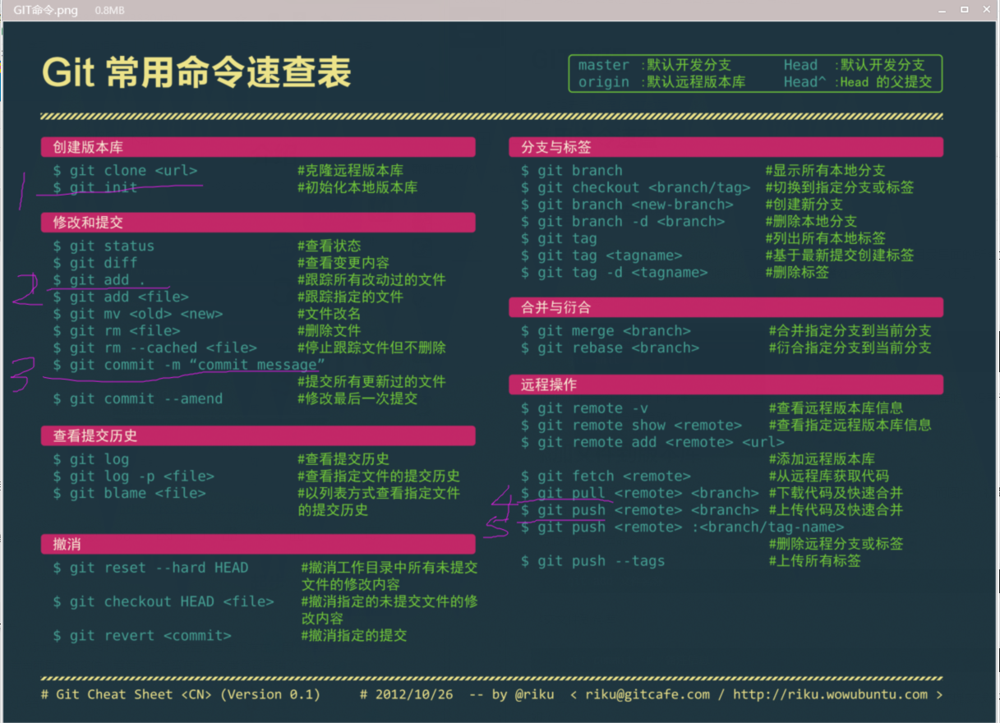
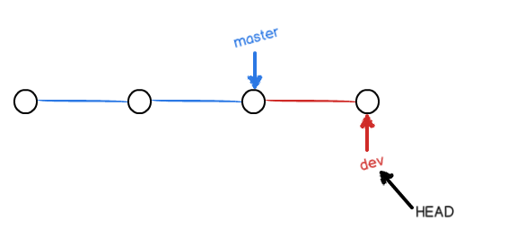

# GIT教程

> 教程来自 [廖雪峰GIT教程](https://www.liaoxuefeng.com/wiki/896043488029600/896827951938304)

## 常用命令速查



## 创建版本库

版本库又名仓库，英文名repository，你可以简单理解成一个目录，这个目录里面的所有文件都可以被Git管理起来，每个文件的修改、删除、Git都能跟踪，以便任何时刻都可以追踪历史，或者在将来某个时刻可以还原。

创建仓库命令

```shell
cd 自己创建的目录
git init
```

创建成功后会在该目录下创建一个 `.git`目录，这个目录是Git跟踪管理版本库的，没事千万不要手动修改这个目录里面的文件，不染改乱了，就把Git仓库给破坏了。

## 添加文件到版本库

首先，所有的版本控制系统，其实只能跟踪文本文件的改动，Git也不例外。而图片、视频这些二进制文件，虽然可能由版本系统管理，但无法跟踪文件的变化，只能把二进制文件每次改动串起来。

添加文件到仓库命令

```shell
git add 文件名称
#添加多个文件
git add file1 file2
#添加多个文件夹中文件
git add folder1/. folder2/.
```

提交文件到仓库

```shell
git commit -m '备注信息'
```

为什么Git添加文件需要 `add`， `commit`一共两步呢？因为 `commit`可以一次提交很多文件，所以你可以多次 `add`不同的文件。

## 查看仓库当前状态

```shell
git status
```

## 对比修改文件

```shell
git diff file
```

## 提交历史记录

```shell
$ git log
#简洁模式
$ git log --pretty=oneline
1094adb7b9b3807259d8cb349e7df1d4d6477073 (HEAD -> master) append GPL
e475afc93c209a690c39c13a46716e8fa000c366 add distributed
eaadf4e385e865d25c48e7ca9c8395c3f7dfaef0 wrote a readme file
```

显示从最近到最远的提交日志，按时间倒序。其中用 `HEAD`表示当前版本，上一个版本是 `HEAD^`，上上一个版本是 `HEAD^^`，往上10个版本可以写成 `HEAD~10`	.

## 回退版本

```shell
git reset --hard HEAD^
```

上面的语句表示回退到上一个版本。可以回退到指定的版本。

```
git reset --hard 指定版本号
```

查找指定的版本号，可以使用**查看命令历史**，这个是后悔药。

```
$ git reflog
e475afc HEAD@{1}: reset: moving to HEAD^
1094adb (HEAD -> master) HEAD@{2}: commit: append GPL
e475afc HEAD@{3}: commit: add distributed
eaadf4e HEAD@{4}: commit (initial): wrote a readme file
```

## 工作区和暂存区

### 工作区（Working Directory）

就是你创建的目录。

### 版本库（Repository）

工作区的隐藏目录 `.git`。其中最重要的就是被称为stage（也叫index）的缓存区，还有Git为我们自动创建的第一个分支 `master`以及指向 `master`的一个指针叫 `HEAD`。


第一步是用`git add`把文件添加进去，实际上就是把文件修改添加到暂存区；

第二步是用`git commit`提交更改，实际上就是把暂存区的所有内容提交到当前分支。

因为我们创建Git版本库时，Git自动为我们创建了唯一一个`master`分支，所以，现在，`git commit`就是往`master`分支上提交更改。

## 撤销修改

```shell
git checkout -- 文件名
```

该命令把指定的文件在工作区的修改全部撤销，这里有两种情况：

一种是文件自修改后还没有添加到缓存区，现在撤销修改就回到和版本库一模一样的状态；

一种是文件已经添加到缓存区后，又做了修改，现在，撤销修改就回到添加到缓存区后的状态；

`git checkout -- file`命令中的 `--`很重要，没有就变成了切换到另一个分支的命令。

`git reset HEAD <file>` 这个命令可以把添加到缓存区后的修改撤销掉，重新放到工作区。当我们用 `HEAD`时表示最新的版本。

## 删除文件

在Git中，删除也是一个修改操作，一般情况下如果直接在文件管理器中把没有用的文件删除了，这个时候Git知道你删除了文件，因此工作区和版本库就不一致 了，`git status`命令会立即告诉你哪些文件被删除了。这时需要在版本库中删除文件的话需要如下命令：

```shell
git rm 文件名
git commit -m '删除备注'
```

## 添加远程仓库

第1步：创建SSH Key。在用户主目录下，看看有没有 `.ssh`目录，，再看看这个目录下有没有`id_rsa`和`id_rsa.pub`这两个文件，如果已经有了，可直接跳到下一步。如果没有，打开Shell（Windows下打开Git Bash），创建SSH Key：

没有，打开Shell（Windows下打开Git Bash），创建SSH Key：

```
$ ssh-keygen -t rsa -C "youremail@example.com"
```

你需要把邮件地址换成你自己的邮件地址，然后一路回车，使用默认值即可，由于这个Key也不是用于军事目的，所以也无需设置密码。

如果一切顺利的话，可以在用户主目录里找到`.ssh`目录，里面有`id_rsa`和`id_rsa.pub`两个文件，这两个就是SSH Key的秘钥对，`id_rsa`是私钥，不能泄露出去，`id_rsa.pub`是公钥，可以放心地告诉任何人

第2步：登陆GitHub，打开“Account settings”，“SSH Keys”页面：

然后，点“Add SSH Key”，填上任意Title，在Key文本框里粘贴`id_rsa.pub`文件的内容

登陆GitHub，然后，在右上角找到“Create a new repo”按钮，创建一个新的仓库。

在自己的目录下运行命令关联到GitHub仓库

```
git remote add origin git@github.com:账户/目录.git
```

推送项目到远程仓库

```shell
git push -u origin master
```

其中 `master`是当前分支，表示把当前分支推送到远程。`-u`参数会把本地的分支和远程的分支关联起来，在以后的推送或者拉取的时候就可以简化命令。

分支关联后就可以使用 `git push origin master`把本地的 `master`分支的最新修改推送到GitHub。

## 从远程库克隆

```shell
git clon git@github.com:账户/库名.git
```

## 创建与合并分支

在版本回退里，你已经知道，每次提交，Git都把它们串成一条时间线，这条时间线就是一个分支。截止到目前，只有一条时间线，在Git里，这个分支叫主分支，即`master`分支。`HEAD`严格来说不是指向提交，而是指向`master`，`master`才是指向提交的，所以，`HEAD`指向的就是当前分支。

一开始的时候，`master`分支是一条线，Git用`master`指向最新的提交，再用`HEAD`指向`master`，就能确定当前分支，以及当前分支的提交点：


每次提交，`master`分支都会向前移动一步，这样，随着你不断提交，`master`分支的线也越来越长。

当我们创建新的分支，例如`dev`时，Git新建了一个指针叫`dev`，指向`master`相同的提交，再把`HEAD`指向`dev`，就表示当前分支在`dev`上：


你看，Git创建一个分支很快，因为除了增加一个`dev`指针，改改`HEAD`的指向，工作区的文件都没有任何变化！

不过，从现在开始，对工作区的修改和提交就是针对`dev`分支了，比如新提交一次后，`dev`指针往前移动一步，而`master`指针不变：




假如我们在`dev`上的工作完成了，就可以把`dev`合并到`master`上。Git怎么合并呢？最简单的方法，就是直接把`master`指向`dev`的当前提交，就完成了合并：


所以Git合并分支也很快！就改改指针，工作区内容也不变！

合并完分支后，甚至可以删除`dev`分支。删除`dev`分支就是把`dev`指针给删掉，删掉后，我们就剩下了一条`master`分支：

创建分支命令

```shell
git checkout -b 分支名
```

其中的 `-b`参数表示创建并切换到分支。也可以使用

```shell
#创建分支
git branch 分支名
#切换分支
git checkout 分支名
```

可以使用 `git branch`命令查看所有分支，在当前分支前面会标一个 `*`号。

合并指定分支到当前分支使用 `git merge`命令。比如合并 `dev`分支到当前分支 `master`可以使用命令。

```shell
git merge dev
```

删除分支命令

```shell
git branch -d 分支名
```

## 切换分支

之前在撤销修改的时候命令是 `git checkout -- <file>`，切换分支使用的命令是 `git checkout <branch>`，同一个命令，有两个作用，缺失有点令人迷惑。

实际上，切换分支使用 `switch`更科学。

创建并切换到新的`dev`分支，可以使用：

```
$ git switch -c dev
```

直接切换到已有的`master`分支，可以使用：

```
$ git switch master
```

使用新的`git switch`命令，比`git checkout`要更容易理解。

Git鼓励大量使用分支：

查看分支：`git branch`

创建分支：`git branch <name>`

切换分支：`git checkout <name>`或者`git switch <name>`

创建+切换分支：`git checkout -b <name>`或者`git switch -c <name>`

合并某分支到当前分支：`git merge <name>`

删除分支：`git branch -d <name>`

强行删除分支：`git branch -D <name>`

## 解决冲突

在使用合并分支的时候如果有冲突，必须手动解决冲突后再提交。 `git status`也可以告诉我们冲突的文件。

在处理完冲突后再提交

```shell
$ git add readme.txt  
$ git commit -m "conflict fixed" 
[master cf810e4] conflict fixed
```

使用待参数的 `git log`也可以看到分支的合并情况：

```
$ git log --graph --pretty=oneline --abbrev-commit
*   cf810e4 (HEAD -> master) conflict fixed
|\  
| * 14096d0 (feature1) AND simple
* | 5dc6824 & simple
|/  
* b17d20e branch test
* d46f35e (origin/master) remove test.txt
* b84166e add test.txt
* 519219b git tracks changes
* e43a48b understand how stage works
* 1094adb append GPL
* e475afc add distributed
* eaadf4e wrote a readme file
```

## 分支管理策略

通常，合并分支时，如果可能，Git会用 `Fast forward`模式，但这种模式下，删除分支后会丢掉分支信息。

如果要强制禁用 `Fast forward`模式，Git就会在merge时生成新的commit，这样，从分支历史上就可以看到分支信息。示例，请注意`--no-ff`参数，表示禁用`Fast forward`：

```shell
git merge --no-ff -m "备注信息" 分支名
```

## 储藏功能

当你工作进行到一半突然接到另外的任务需要立即修改，但是目前无法提交的时候可以使用该功能。

```shell
git stash
```

操作完成后使用 `git status`查看工作区，就是干净的了（除非有没有被Git管理的文件），因此可以放心的创建分支来修复Bug。

完成之后，使用 `git stash list`命令查看刚才的工作现场。

现在需要恢复一下，有两个办法：

1. 使用 `git stash apply`恢复，但是恢复后，stash内容并不删除，你需要用 `git stash drop`来删除。
2. 使用 `git stash pop`恢复的同时把stash内容也删除了

## 复制一个特定的提交到当前分支

`git cherry-pick 版本号 ` Git自动给dev分支做了一次提交，注意这次提交的commit是`1d4b803`，它并不同于master的`4c805e2`，因为这两个commit只是改动相同，但确实是两个不同的commit。

## 查看远程库信息

```shell
git remote
```

也可以使用 `-v`参数显示更详细的信息

从本地推送分支，使用`git push origin branch-name`，如果推送失败，先用`git pull`抓取远程的新提交；

在本地创建和远程分支对应的分支，使用`git checkout -b branch-name origin/branch-name`，本地和远程分支的名称最好一致；

建立本地分支和远程分支的关联，使用`git branch --set-upstream branch-name origin/branch-name`；

从远程抓取分支，使用`git pull`，如果有冲突，要先处理冲突。

## 変基

```shelll
git rebase
```

## 标签操作

```shell
git tag 标签号 <版本号>
```

## 查看标签列表

```shell
git tag
```

## 查看标签明细

```shell
git show <标签号>
```

## 创建带有说明的标签

```shell
git tag -a <标签号> -m '备注信息' <版本号>
```

## 删除标签

```shell
git tag -d 标签号
```

## 推送某个标签到远程

```shell
git push origin <标签号>
```

## 一次性推送全部尚未推送到远程的本地标签

```shell
$ git push origin --tags
```

## 删除远程标签

```shell
git tag -d 标签
#推送到远程
git push origin :refs/tags/标签
```

## 添加忽略文件

在工作区的根目录下创建一个特殊的 `.gitignore`，然后把要忽略的文件名添加进去，Git会自动忽略这些文件。

