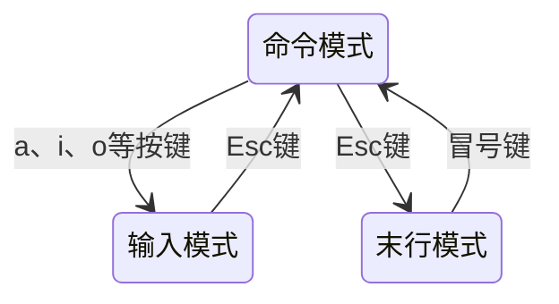

# LUNUX就该这么学读后感

> [Linux就该这么学]:https://www.linuxprobe.com/chapter-02.html

## 基础命令篇

##### man命令帮助信息的结构和意义

> https://www.linuxprobe.com/chapter-02.html

| 结构名称    | 代表意义             |
| :---------- | :------------------- |
| NAME        | 命令的名称           |
| SYNOPSIS    | 参数的大致使用方法   |
| DESCRIPTION | 介绍说明             |
| EXAMPLES    | 演示（附带简单说明） |
| OVERVIEW    | 概述                 |
| DEFAULTS    | 默认的功能           |
| OPTIONS     | 具体的可用选项       |
| ENVIRONMENT | 环境变量             |
| FILES       | 用到的文件           |
| SEE ALSO    | 相关的资料           |
| HISTORY     | 维护历史和联系方式   |


##### date命令

| 参数 | 作用          |
| ---- | ------------- |
| %t   | 跳格[Tab键]   |
| %H   | 小时（00~23） |
| %I   | 小时（00~12） |
| %M   | 分钟（00~59） |
| %S   | 秒（00~59）   |
| %j   | 今年中第几天  |
| %Y   | 年            |
| %m   | 月（01~12）   |
| %d   | 天（01-31）   |

###### 实例

```bash
##展示时间
date
##格式化展示时间
date "+%Y-%m-%d%t%H:%M:%S"
##设置时间
date -s "20190901  8:30:00"
```

##### reboot命令

*用于重启系统*

##### poweroff命令

*用于关闭系统*

##### wget命令

*用于在终端中下载网络文件格式为`wget [参数] 下载地址`*

| 参数 | 作用                               |
| ---- | ---------------------------------- |
| -b   | 后台下载模式                       |
| -P   | 下载到指定目录                     |
| -t   | 最大尝试次数                       |
| -c   | 断点续传                           |
| -p   | 下载页面内所有资源，包括图片视频等 |
| -r   | 递归下载                           |

##### ps命令

*用于显示当前进程（process）的状态，语法`ps [options] [--help]`*

| 参数 | 作用                               |
| ---- | ---------------------------------- |
| a    | 显示所有进程（包括其他用户的进程） |
| u    | 用户及其他详细信息                 |
| x    | 显示没有控制终端的进程             |
| -ef  | 显示所有进程信息，连同命令行       |
| -aux | 列出目前所有的在内存中的程序       |
| e    | 显示环境变量                       |
| f    | 显示程序间的关系                   |

###### 进程状态码

- R 运行 runnable

- D uninterruptible sleep(usually IO),不可中断(收到信号不唤醒和不可运行，进程必须等待直到中断发生)

- S sleeping,中断(休眠中，受阻，在等待某个条件的形成或收到信号)

- T traced or stopped,停止(进程收到SIGSTOP,SIGTSTP,SIGTTIN,SIGTTOU信号后停止运行)

- Z a defunct("zombie") process,僵死(进程已终止，但进程描述符存在)

##### top命令

*用于动态的监视进程活动与系统负载等信息*

**top命令执行结果的前5行为系统整体的统计信息代表的含义**

- 第一行：系统时间、运行时间、登录终端数、系统负载（三个数值分别为1分钟、5分钟、15分钟内的平均值，数值越小负载越低）

- 第二行：进程总数、运行中的进程数、休眠中的进程数、停止的进程数、僵死的进程数

- 第三行：用户占用资源百分比、系统内核占用资源百分比、改变过优先级的进程资源百分比、空闲的资源百分比等

- 第四行：物理内存总量、内存使用量、内存空闲量、作为内核缓存的内存量

- 第五行：虚拟内存总量、虚拟内存使用量、虚拟内存空闲量、已被提前加载的内存量  

##### pidof命令

*用于查询某个指定服务进程的PID值格式为`pidof [参数][服务名称]`*

| 参数       | 作用                                   |
| ---------- | -------------------------------------- |
| -s         | 返回多进程，返回一个PID                |
| -c         | 只返回进程的ID                         |
| -x         | 重复命中，返回指定程序的shell脚本的PID |
| -o<进程号> | 告诉pidof忽略带有进程id的进程          |

##### kill命令

*用于终止指定的PID的服务进程，格式为`kill [参数][进程PID]`  -9表示强制停止*

##### killall命令

*用于终止某个指定名称的服务所对应的全部进程*

##### ifconfig命令

*用于获取网卡配置与网络状态信息*

##### uname命令

*用于查看系统内核与系统版本等信息，格式为`uname -a`*

##### uptime命令

*用于查看系统负载信息包含系统时间、系统已运行时间、启用终端数以及平均负载值等信息*

##### free命令

*用于显示当前系统内存的使用信息格式为`free -h`*

##### cat命令

*用于查看纯文本的文件（内容较少的）格式为`cat[参数][文件]`，如果想在文本内容中显示行号可以加-n参数*

##### more命令

*用于查看纯文本文件（内容较多的）格式为`more[参数][文件]`*

| 参数      | 作用                                                 |
| --------- | ---------------------------------------------------- |
| -num      | 一次显示的行数                                       |
| -d        | 提示使用者空格键下一页，'q'键退出                    |
| -I        | 取消预先特殊子元^L时会暂停的功能                     |
| -f        | 计算行数时，以实际的行数，而非自动换行后的行数       |
| -p        | 不以卷动的方式显示每一行，而是先清除屏幕后再显示内容 |
| -s        | 遇到有连续两行以上的空白行，就带代换为一行空白行     |
| +/pattern | 在文档显示前搜索改字符串，然后从该字符串之后开始显示 |
| +num      | 从第num行开始显示                                    |

**常用操作命令**

- Enter 向下n行，需要定义。默认为1行

- Ctrl+F 向下滚动一屏

- 空格键 向下滚动一屏

- Ctrl+B 向上滚动一屏

- = 输出当前行的行号

- :f  输出文件名和当前行的行号

- V 调用vi编辑器

- !commend 调用Shell，并执行命令commend

- q退出more

##### head命令

*查看纯文本的前N行，格式为`head -n 20 file`*

##### tail命令

*用于查看纯文本文档最后N行或持续刷新内容，格式为`tail [选项][文件]`*

##### tr命令

*用于替换文本文件中的字符格式为`tr [原始字符][目标字符]`*

##### wc命令

*统计指定文本的行数、字数、字节数*

| 参数 | 作用         |
| ---- | ------------ |
| -l   | 只显示行数   |
| -w   | 只显示单词数 |
| -c   | 只显示字节数 |

##### stat命令

*查看文件的具体存储信息和时间等信息*

##### cut命令

*按列提取文本字符，格式为`cut -d[分割符号] -f[展示列] file`*

##### diff命令

*比较多个文本文件的差异` --brief`参数显示比较后的结果。` -c`描述文件内容具体的不同*

##### touch命令

*创建空白文件或设置文件的时间格式为`touch [选项] [文件]`*

| 参数 | 作用                    |
| ---- | ----------------------- |
| -a   | 仅修改读取时间（atime） |
| -m   | 仅修改修改时间（mtime） |
| -d   | 同时修改atime和mtime    |

##### mkdir命令

*创建空白的目录，`-p`参数用于创建递归的文件目录*

##### cp命令

*复制文件或者目录，格式为`cp [选项] 源文件 目标文件`*

| 参数 | 作用                                     |
| ---- | ---------------------------------------- |
| -p   | 保留原始文件的属性                       |
| -d   | 若对象为链接文件，则保留该链接文件的属性 |
| -r   | 递归持续复制（用于目录）                 |
| -i   | 若目标文件存在则询问是否覆盖             |
| -a   | 相当于-pdr                               |

##### mv命令

*剪切文件或将文件重命名，格式为`mv [选项] 源文件 [目标路径|目标文件名]`*

##### rm命令

*删除文件或目录`-r`参数代表递归*

##### dd命令

*按照指定大小和个数的数据块来复制文件或转换文件，`/dev/zero`内含无穷大文件*

| 参数  | 作用           | 示例         |
| ----- | -------------- | ------------ |
| if    | 输入的文件名称 | if=/dev/zero |
| of    | 输出的文件名称 | of=fileName  |
| bs    | 设置每块的大小 | bs=560M      |
| count | 设置块的个数   | count=1      |

##### file命令

*查看文件的类型*

##### tar命令

*对文件进行打包压缩或解压*

| 参数 | 作用                   |
| ---- | ---------------------- |
| -c   | 创建压缩文件           |
| -x   | 解开压缩文件           |
| -t   | 查看压缩包内有哪些文件 |
| -z   | Gzip压缩或解压         |
| -j   | 用bzip2压缩或解压      |
| -v   | 显示压缩或解压的过程   |
| -f   | 目标文件名             |
| -p   | 保留原始的权限和属性   |
| -P   | 使用绝对路径来压缩     |
| -C   | 指定解压到的目录       |

**`tar -czvf target.tar.gz targetdir`创建压缩包，`tar -xzvf target.tar.gz -C dir` 解压到指定目录**

##### grep命令

*在文本汇总执行关键词搜索，并显示匹配的结果*

| 参数         | 作用                                             |
| ------------ | ------------------------------------------------ |
| -b           | 将可执行文件（binary）当做文本文件（text）来搜索 |
| -c           | 仅显示找到的行数                                 |
| -i           | 忽略大小写                                       |
| -n           | 显示行号                                         |
| -v           | 反向选择，仅列出没有关键词的行                   |
| -A<显示行数> | 显示该行和该行后指定行数的内容                   |
| -B<显示行数> | 显示该行和该行前指定行数的内容                   |
| -C<显示行数> | 显示该行和该行前后指定行数的内容                 |
| --color      | 匹配的内容已颜色高亮显示                         |
| -w           | 只显示全字符符合的列                             |

##### find命令

*安装指定的条件查找文件，格式为`find [查找路径] 条件 操作`*

| 参数               | 作用                                                         |
| ------------------ | ------------------------------------------------------------ |
| -name              | 匹配名称                                                     |
| -perm              | 匹配权限（mode为完全匹配，-mode为包含即可）                  |
| -user              | 匹配所有者                                                   |
| -group             | 匹配所有组                                                   |
| -mtime -n +n       | 匹配修改内容的时间（-n指n天以内，+n指n天以前）               |
| -atime -n +n       | 匹配访问文件的时间（-n指n天以内，+n指n天以前）               |
| -ctime -n +n       | 匹配修改文件权限的时间（-n指n天以内，+n指n天以前）           |
| -nouser            | 匹配无所有者的文件                                           |
| -nogroup           | 匹配无所有组的文件                                           |
| --type b/d/c/p/l/f | 匹配文件类型（后面的文件依次代表块设备、目录、字符设备、管道、链接文件、文本文件） |
| -size              | 匹配文件的大小（+50KB为查找超过50KB的文件，而-50KB为查找小于50KB的文件） |
| -prune             | 忽略某个目录                                                 |
| -exec …… {} \;     | 后面可进一步处理搜索结果命令                                 |

## 管道符、重定向与环境变量

##### 输入输出重定向

*输入重定向是指把文件导入到命令中，输出重定向是指把原本要输出到屏幕的数据信息写入到指定的文件*

- 标准输入重定向（STDIN，文件描述符为0）：默认从键盘输入，也可从其他文件或命令中输入。
- 标准输出重定向（STDOUT，文件描述符为1）：默认输出到屏幕
- 错误输出重定向（STDERR，文件描述符为2）：默认输出到屏幕

###### 输入重定向

| 符号                 | 作用                                         |
| -------------------- | -------------------------------------------- |
| 命令 < 文件          | 将文件作为命令的标准输入                     |
| 命令 << 分界符       | 从标准输入中读取，直到遇见分界符才停止       |
| 命令 < 文件1 > 文件2 | 将文件1作为命令的标准输入并将标准输出到文件2 |

###### 输出重定向

| 符号              | 作用                                                       |
| ----------------- | ---------------------------------------------------------- |
| 命令 > 文件       | 将标准输出重定向到一个文件中（清空原有文件的数据）         |
| 命令 2> 文件      | 将错误输出重定向到一个文件中（清空原有文件的数据）         |
| 命令 >> 文件      | 将标准输出重定向到一个文件中（追加到原有内容的后面）       |
| 命令 2>> 文件     | 将错误输出重定向到一个文件中（追加到原有内容的后面）       |
| 命令 >> 文件 2>&1 | 将标准输出与错误输出共同写入到文件中（追加到原有内容后面） |
| 命令 &>> 文件     | 同上                                                       |

##### 管道命令符

`命令A | 命令B`，作用是把前一个命令的标准输出刀座后一个命令的标准输入。

例如 `ls -l | grep aa``就会只显示目录中包含aa的文件`。

当后面的命令不支持接收这种类型的参数时可以使用`命令1 | xargs -i 命令2{}`，此时参数 `-i`表示把前面的标准输出一行一行赋值给 `{}`。

##### 命令行的通配符，模式扩展

命令汇总的通配符由Bash先进行扩展再执行命令。扩展的结果是由Bash负责的，与所要执行的命令无关。命令本身并不存在参数扩展，收到什么参数就原样执行。模式扩展（globbing）可以关闭与开启

```shell
#关闭扩展
set -o noglob
#或者
set -f
#重新打开扩展
set +o noglob
#或者
set +f
```

`~`自动扩展为当前用户的主目录， `~user`表示 `user`的主目录，`~+`表示当前所在目录等同于 `pwd`命令。

`?`代表文件路径里面的任意单个字符，不包括空字符。比如`data???`匹配 `data111`。`?`扩展输入文件名扩展，只有文件确实存在的前提下，才会发生扩展。如果文件不存在，扩展不会发生。

`*`代表文件路径里面的任意数量的任意字符，包括零个字符。但是 `*`不会匹配隐藏文件（以 `.`开头的文件），如果需要匹配隐藏文件需要写成 `.*`。`*`属于文件名扩展，只有文件确实存在的情况下才会扩展。如果文件不存在，就会原样输出。`*`只匹配当前目录，不会匹配子目录。

`[...]`只有文件确实存在的前提下才会扩展。匹配括号里面的任意一个字符。变体还有 `[^...]`和 `[!...]`它们表示匹配不在括号里面的字符。如 `[abc]`

`[start-end]`表示匹配一个连续的范围中任意一个字符。如 `[a-z]`表示所有小写字母。变体还有 `[^a-z]`和 `[!a-z]`它们表示匹配不是小写字母的字符。

`{...}`表示分别扩展成大括号里面的所有值，各值之间使用逗号分割。`{...}`不是文件名扩展。它会扩展成所有给定的值，而不管是否有对应的文件存在。如 `{a,b,c}`，内部逗号前后不能有空格。大括号可以嵌套也可以与其他模式联用，并且总是优于其他模式进行扩展。

`{start..end}`表示扩展成一个连续的序列。比如 `{a..z}`可以扩展成26个小写英文字母。同时支持逆序 `{c..a}`输出为 `c b a`

，如果遇到无法理解的简写，大括号模式就会原样输出。如果在整数前面有前导 `0`，口占输出每一项都有前导 `0`。如 `{01..3}`输出为 `01 02 03`

`{start..end..step}`用来指定扩展的步长。

`$`开头的词元被视为变量将其扩展为变量值，同时支持 `${变量}`。

`${!string*}`或 `${!string@}`返回所有匹配给定字符串string的变量名。

`$(命令)`扩展为命令的运行结果，可以嵌套。

`$((2 + 2))`扩展为整数运算结果。

##### 转义字符

`\`原样输出后面的内容。

`''`原样输出里面包含的内容。

`""`把里面的（ $ ， \`，\） 自动扩展后输出。

\`\`返回里面的命令的执行结果。

##### 环境变量

变量是计算机系统用于保存可编制的数据类型。在Linux系统中，变量名称一般都是大写，这是约定俗成的规范。我们可以直接通过变量名称来提取到对应的变量值。环境变量是用来定义系统运行环境的一些参数。重要的环境变量有：

| 变量名称     | 作用                             |
| ------------ | -------------------------------- |
| HOME         | 用户的主目录                     |
| SHELL        | 用户在使用的SHELL解释器名称      |
| HISTSIZE     | 输出的历史命令记录条数           |
| HISTFILESIZE | 保存的历史命令记录条数           |
| MAIL         | 邮件保存路径                     |
| LANG         | 系统语言、语系名称               |
| RANDOM       | 生成一个随机数字                 |
| PS1          | BASH解释器的提示符               |
| PATH         | 定义解释器搜索用户执行命令的路径 |
| EDITOR       | 用户默认的文本编辑器             |

可以使用 `export`命令将变量提升为全局变量。

## VIM编辑器与SHELL脚本

##### 三种模式的操作区别

- 命令模式：控制光标移动，可对文本进行复制、粘贴、删除、和查找等工作。
- 输入模式：正常的文本录入。
- 末行模式：保存或退出文档，以及设置编辑环境，批量替换。

##### 三种模式的切换方法



##### 命令模式中常见的命令

| 命令 | 作用                                 |
| ---- | ------------------------------------ |
| dd   | 删除光标所在整行                     |
| 5dd  | 删除光标所在开始的5行                |
| yy   | 复制光标所在整行                     |
| 5yy  | 复制光标所在开始的5行                |
| n    | 显示搜索命令定位到的下一个字符串     |
| N    | 显示搜索命令定位到的上一个字符串     |
| u    | 撤销上一步操作                       |
| p    | 将之前删除或复制的数据粘贴到光标后面 |

##### 末行模式中的常见命令

| 命令          | 作用                                 |
| ------------- | ------------------------------------ |
| :w            | 保存                                 |
| :q            | 退出                                 |
| :q!           | 强制退出                             |
| :wq!          | 强制保存退出                         |
| :set nu       | 显示行号                             |
| :set nonu     | 不显示行号                           |
| :命令         | 执行命令                             |
| :整数         | 跳转到该行                           |
| :s/one/two    | 将当前光标所在行的第一个one替换为two |
| :s/one/two/g  | 将当前光标所在行的全部one替换为two   |
| :%s/one/two/g | 将全文中所有one替换为two             |
| ?字符串       | 在文本中从下到上搜索该字符串         |
| /字符串       | 在文本中从上到下搜索该字符串         |

