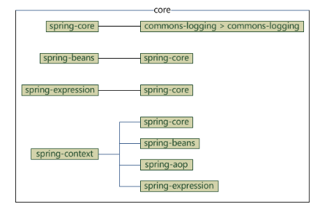

# Spring 学习总结

*参考网站[w3cschool](https://www.w3cschool.cn/wkspring/pesy1icl.html)*

## Spring 概述

### 概述

Spring是最受欢迎的企业级Java应用程序开发框架，数以百万的来自实践各地的开发人员使用Spring框架来创建性能好、易于测试、可重用的代码。

Spring框架是一个开源的Java平台，它最初是由Rod Johnson编写的，并且于2003年6月首次在Apache 2.0许可下发布。

Spring是轻量级的框架，其基础版本只有2MB左右大小。

Spring框架的核心特性时可以用于任何Java应用程序，但是在Java EE平台上构建web应用程序是需要扩展的。Spring框架的目标是使J2EE开发变得容易使用，通过启用 POJO编程模型来促进良好的编程实践。

### 三层架构

- A 表现层 web层 MVC是表现层的一个设计模型
- B 业务层 service层
- C 持久层 dao层

### 使用Spring框架的好处

下面列出的是使用Spring框架的主要好处：

- Spring可以是开发人员使用POJO开发企业级的应用程序。只使用POJO的好处是你不需要一个EJB容器产品，比如一个应用程序服务器，但是你可以选择使用一个健壮的servlet容器，比如Tomcat或者一些商业产品
- Spring在一个单元模式中是有组织的。即使包和类的数量非常大，你只需要担心你需要的，而其他的就可以忽略了
- Spring不会让你白费力气做重复的工作，它真正的利用了一些现有的技术，想ORM框架、日志框架、JEE、Quartz和JDK计时器，其他视图技术。
- 测试一个用Spring编写的应用程序很容易，因为环境相关的代码被移动到这个框架中。此外，通过使用JavaBean-style POJOs ，它在使用依赖注入注入测试数据的时候变得很容易。
- Spring的web框架是一个设计良好的web MVC框架，它为比如Structs或者其他工程上的或者不怎么受欢迎的web框架提供了一个很好的可供替代的选择。MVC模式导致应用程序的不同方面（输入逻辑、业务逻辑和UI逻辑）分离，同时提供这些元素之间的松散耦合。
  - 模型（Model）封装了应用程序数据，通常它们将由POJO类组成
  - 视图（View）负责渲染模型数据，一般来说它生成客户端浏览器可以解释HTML输出。
  - 控制器（Controller）负责处理用户请求并构建适当的模型，并将其传递给视图进行渲染。

- Spring对JavaEE开发中非常难用的一些API（JDBC、JavaMail、远程调用等）都提供了封装，使这些API应用难度大大降低。
- 轻量级的IOC容器往往是轻量级的。例如，与EJB容器相比的时候。这有利于内存和CPU资源有限的计算机开发和部署应用程序。
- Spring提供了一致的事务管理接口，可以向下扩展到（使用一个单一的数据库，例如）本地事务并扩展到全局事务（例如使用JTA）。

### 依赖注入（DI）

Spring最认同的技术就是控制反转的**依赖注入（DI）**模式。控制反转（IOC）是一个通用的概念，他可以有许多不同的方式去表达，依赖注入仅仅是控制反转的一个具体的例子。

当编写一个复杂的JAVA应用程序时，应用程序应该尽可能的独立与其他的Java类来增加这些类可重用的可能性，当进行单元测试时，可以使他们独立于其他类进行测试。依赖注入（有时被称为配线）有助于将这些类粘合在一起，并且在同时让它们保持独立。

### 面向切面的程序设计（AOP）

Spring框架的一个关键组件是面向方面的程序设计（AOP）框架。一个程序中跨越多个点的方法被称为横切关注点。这些横切关注点在概念上独立于应用程序的业务逻辑。

## Spring 体系结构

Spring有可能成为所有企业应用程序的一站式服务点，然而，Spring是模块化的，允许你挑选适用于你的模块，不必要把剩余部分也引入。下面的部分对在Spring框架中所有可用的模块给出了详细的介绍。

Spring框架提供了约20个模块，可以根据应用程序的要求来使用。

### 核心容器

核心容器由spring-core、spring-beans、spring-context、spring-context-support和spring-expression（SqEL，Spring表达式语言，Spring Expression Language）等模块组成，它们的细节如下：

- spring-core模块提供了框架的基本组成部分，包括IOC和依赖注入功能。
- spring-beans模块提供了BeanFactory，工厂模式的微妙实现，它溢出了编码式单例的需要，并且可以把配置和依赖从实际编码逻辑中解耦。
- context模块建立在由core和beans模块的基础上建立起来的，它以一种类似于JNDI注册的方式访问对象。Context模块继承自Bean模块，并且添加了国际化（比如，使用资源束）、事件传播、资源加载和透明的创建上下文（比如通过Servelet容器）等功能。Context模块也支持Java EE的功能，比如EJB、JMX和远程调用等。ApplicationContext接口是Context模块的焦点。spring-context-support提供了对第三方库集成到Spring上下文的支持，比如缓存（EhCache，Guava，JCache）、邮件（JavaMail）、调度（CommonJ，Quartz）、模板引擎（FreeMarker，JasperReports，Velocity）等。
- spring-expression模块提供了强大的表达式语言，用于在运行时查询和操作对象图。它是JSP2.1规范中定义的统一表达式语言的扩展，支持set和get属性值、属性赋值、方法调用、访问数组集合及索引的内容、逻辑算数运算。命名变量、通过名字从Spring IOC容器检索对象，还支持列表的投影、选择以及聚合等。

它们的完整依赖关系如下图所示：

### 数据访问/集成

数据访问/集成层包括JDBC、ORM、OXM、JMS和事务处理模块，它们的细节如下：

**（JDBC=Java Data Base Connectivity，ORM=Object Relational Mapping，OXM=Object XML Mapping，JMS=Java Message Service）**

- JDBC 模块提供了JDBC抽象层，它消除了冗长的JDBC编码和对数据库供应商特定的错误代码的解析。
- ORM 模块提供了对流行的对象关系映射API的集成，包括JPA、JDO和Hibernate等。通过此模块可以让这些ORM框架和Spring的其他功能整合，比如前面提到的事务管理。
- OXM 模块提供了对OXM实现的支持，比如JAXB、Castor、XML Beans、JiBX、XStream等。
- JMS 模块包含了生产（produce）和消费（consume）消息的功能。从Spring 4.1开始，集成了spring-messaging模块。
- 事务模块为实现特定接口类及所有的POJO支持编程式和声明式事务管理。（注：编程式事务需要自己写beginTransaction()、commit()、rollback()等事务管理办法，声明式事务是通过注解或配置由spring自动处理，编程式事务粒度更细）

### Web

Web层由Web，Web-MVC、Web-Socket和Web-Portlet组成，它们的细节如下：

- Web模块提供面向web的基本功能和面向web的应用上下文，比如多部分（multipart）文件上传功能、使用Servlet监听器初始化IOC容器等。它还包括HTTP客户端以及Spring远程调用中与web相关的部分。
- Web-MVC 模块为web应用提供了模型视图控制（MVC）和REST Web服务的实现。Spring的MVC框架可以使领域模型代码和web表单完全的分离，且可以与Spring框架的其他所有功能进行集成。
- Web-Portlet模块提供了用于Portlet环境的MVC实现，并反映了spring-webmvc模块的功能。

### 其他

还有其他一些重要的模块，像AOP、Aspects、Instrumentation、Web和测试模块，它们的细节如下：

- AOP模块提供了面向方面的编程实现，允许你定义方法拦截器和切入点对代码进行干净的解耦，

