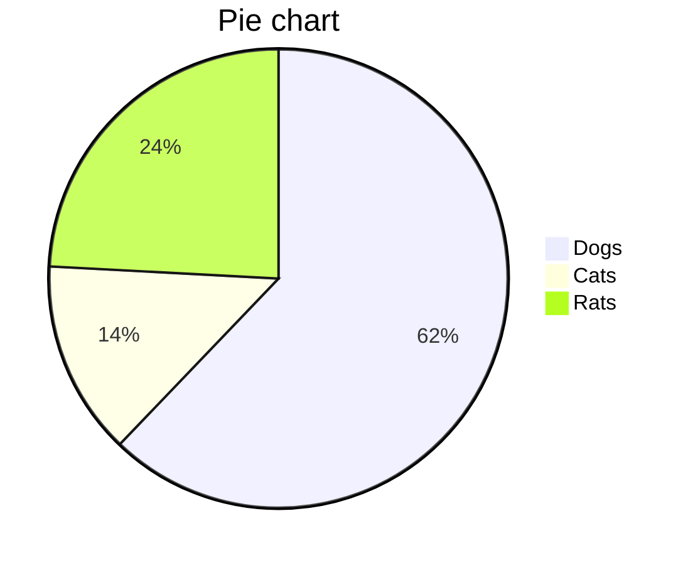
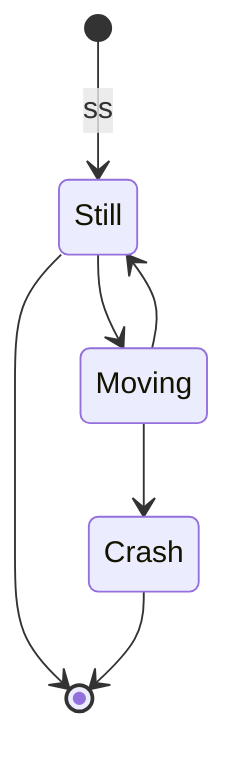
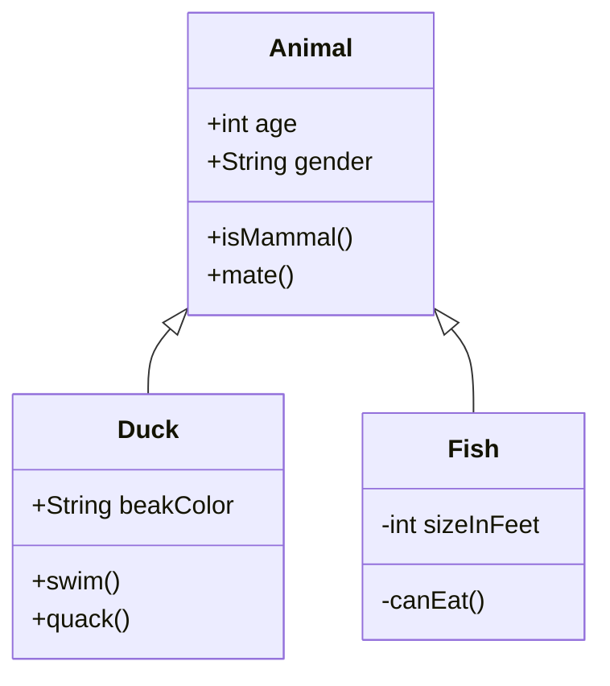
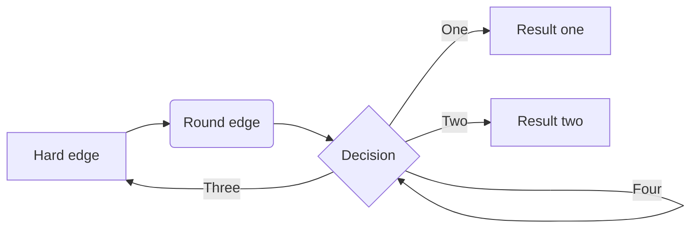
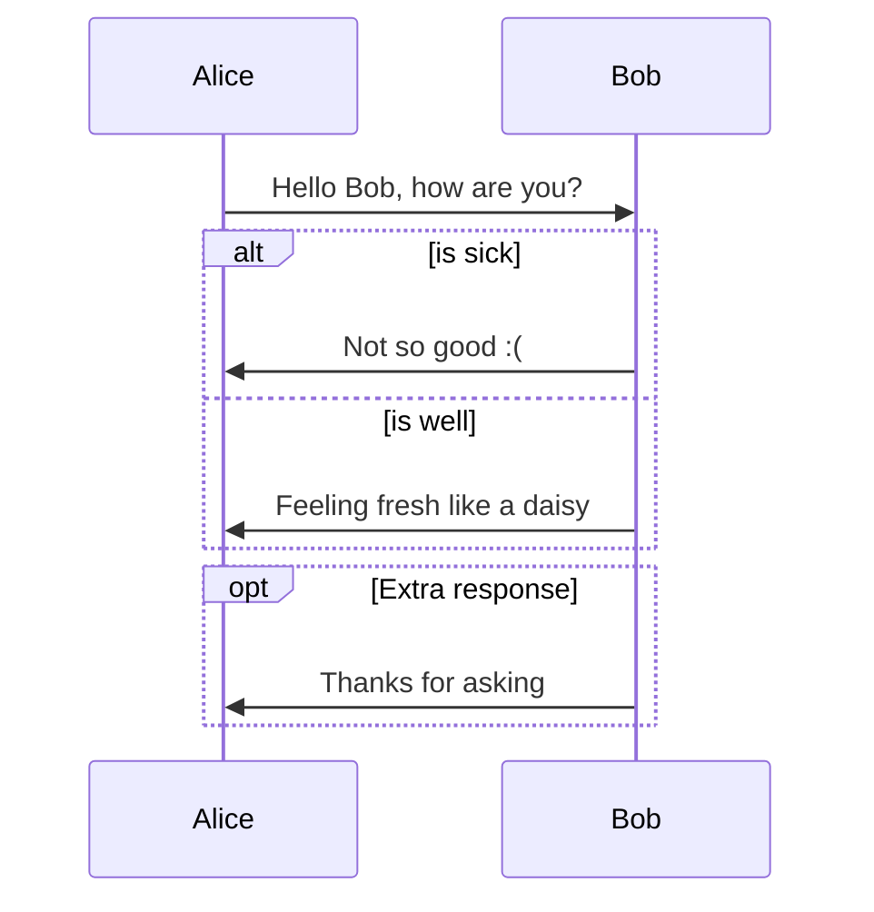
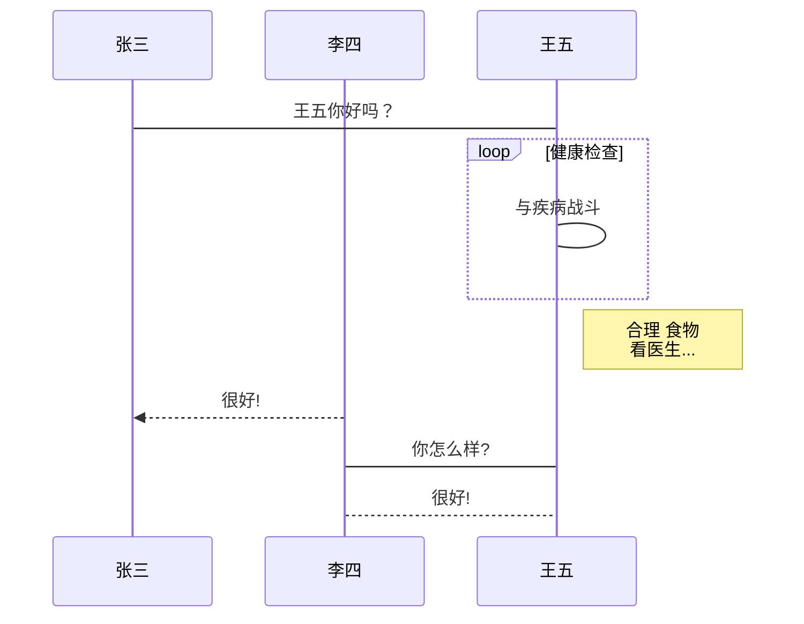
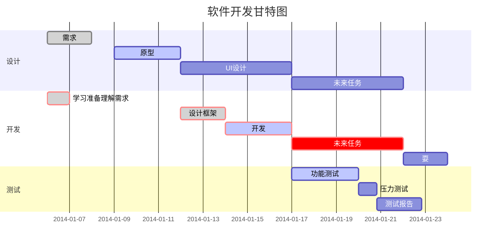

# typora画图











```flow
%%流程
st=>start: Start
op=>operation: Your Operation
cond=>condition: Yes or No?
sub1=>subroutine: 子流程
io=>inputoutput: 输入输出框
e=>end

st->op->cond
cond(yes)->io->e
cond(no)->sub1(top)->op
```

时序图（不支持%%注释）

```sequence
Alice->Bob: Hello Bob, how are you?
Note right of Bob: Bob thinks
Bob-->Alice: I am good thanks!
Note over Alice,Bob: over
```





